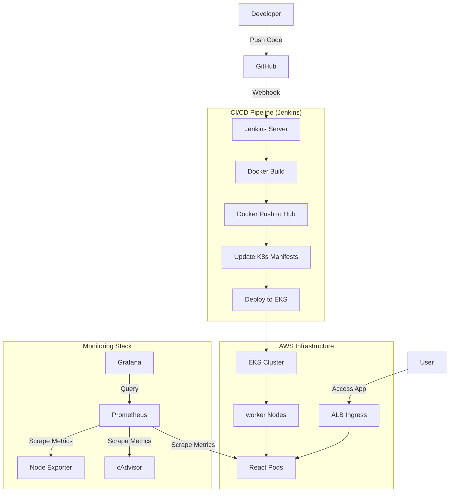

# 🚀 React CI/CD EKS DevOps Pipeline

This project demonstrates a production-ready DevOps CI/CD pipeline for deploying a containerized React application to AWS EKS, featuring automated builds, deployments, and comprehensive monitoring with Prometheus and Grafana.

---

## 🏗️ Architecture Overview

The pipeline automates the journey from code commit to a live production environment on AWS.



---

## 🛠️ Technology Stack

| Category | Tools |
| :--- | :--- |
| **Frontend** | React, Nginx (Static Hosting) |
| **CI/CD** | Jenkins, GitHub Webhooks |
| **Containerization** | Docker, Docker Hub |
| **Orchestration** | Kubernetes (AWS EKS) |
| **Infrastructure** | Terraform, AWS CLI |
| **Monitoring** | Prometheus, Grafana, Node Exporter, cAdvisor |

---

## 📋 Prerequisites (Windows Optimized)

- **Docker Desktop**: For local container testing.
- **AWS CLI**: Configured with `aws configure`.
- **Terraform**: For infrastructure automation.
- **kubectl**: For interacting with the EKS cluster.
- **eksctl** (Optional): For simplified EKS cluster management.
- **Jenkins**: Accessible via EC2 or local installation.

---

## 🚀 Getting Started

### 1. Local Development & Monitoring
You can run the application along with the monitoring stack locally using Docker Compose.

```powershell
# Clone the repository
git clone <repository-url>
cd react-cicd-eks-devops-pipeline-main

# Spin up the app and monitoring stack
docker compose up -d --build
```

**Access Points:**
- **React App**: [http://localhost:8080](http://localhost:8080)
- **Prometheus**: [http://localhost:9090](http://localhost:9090)
- **Grafana**: [http://localhost:3001](http://localhost:3001) (User: `admin`, Pass: `admin`)
- **cAdvisor**: [http://localhost:8081](http://localhost:8081)

---

### 2. Infrastructure Setup (AWS)
Navigate to the terraform directory to provision the VPC and EKS infrastructure.

```powershell
cd terraform-test
terraform init
terraform apply --auto-approve
```

---

### 3. CI/CD Pipeline Configuration (Jenkins)

The pipeline is defined in the `Jenkinsfile` and includes the following stages:

1.  **Docker Build**: Creates a production-ready image using the `Dockerfile`.
2.  **Docker Push**: Tag and push the image to Docker Hub (`rajbirari9737/trend-app`).
3.  **Update Manifests**: Dynamically updates `trend-app.yml` with the latest build number.
4.  **Local Monitoring**: Ensures the local monitoring stack is running.
5.  **EKS Deployment**: Configures `kubeconfig` and applies deployment, service, and ingress manifests.

**Required Jenkins Credentials:**
- `dockerhubcreadentials`: Docker Hub Username/Password.
- `AWScreadentials`: AWS Access Key and Secret Key.

---

### 4. Kubernetes Deployment

The application is deployed using three primary manifests:
- **`trend-app.yml`**: Defines the deployment with 1 replica of the React app.
- **`trend-service.yml`**: Configures a `NodePort` service to expose the app.
- **`trend-ingress.yml`**: Sets up an AWS Application Load Balancer (ALB) to route external traffic.

**Verify Deployment:**
```powershell
# Update local kubeconfig
aws eks update-kubeconfig --region us-east-1 --name trend-eks-cluster

# Check resources
kubectl get all
kubectl get ingress
```

---

### 5. Monitoring with Prometheus & Grafana

The monitoring stack tracks the health and performance of the cluster and containers.

- **Prometheus**: Scrapes metrics from the EKS nodes and the running containers.
- **Grafana**: Provides visual dashboards. Once logged in, add Prometheus as a data source (`http://prometheus:9090`) and import representative dashboards for Kubernetes.

---

## 🧹 Clean Up

To avoid unnecessary AWS costs, destroy the infrastructure when finished:

```powershell
# Delete K8s resources
kubectl delete -f trend-ingress.yml
kubectl delete -f trend-service.yml
kubectl delete -f trend-app.yml

# Destroy Terraform infrastructure
cd terraform-test
terraform destroy --auto-approve
```

---
*Created with ❤️ by the DevOps Team*
